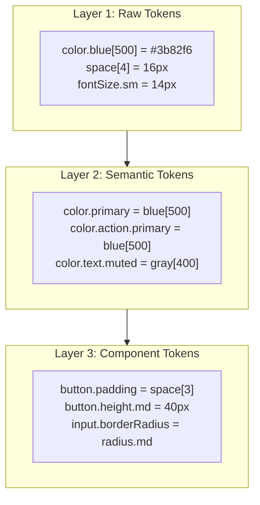

MoodUI sử dụng kiến trúc **3-layer token system** được lấy cảm hứng từ design token chuẩn công nghiệp.

## 3 Lớp Token



## Theme Contract

Theme Contract là interface TypeScript **không chứa vanilla-extract**, là lớp abstraction công khai cho consumer:

```typescript
import type { ThemeContract } from 'mood-ui/theme';
// ThemeContract chứa tất cả type cho color, typography, spacing...
```

## Consumer Override

Có 3 cách để override theme:

1. **CSS Override** (đơn giản nhất)
2. **Programmatic Theme** (config JS object)
3. **Runtime Token Override** (live-update)
